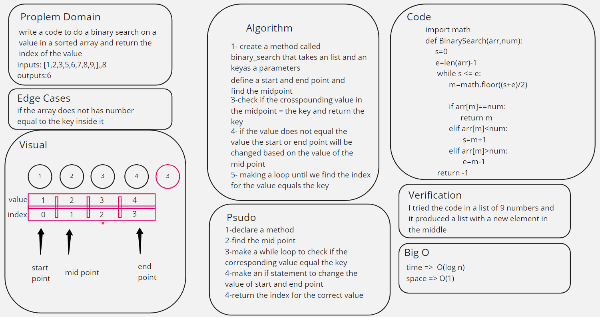

# Binary Search of Sorted Array
<!-- Description of the challenge -->
to right a function that do a binary search on a sorted array and return the index for the corrseponding value
## Whiteboard Process
<!-- Embedded whiteboard image -->

## Approach & Efficiency
1-declare a method

2-find the mid point

3-make a while loop to check if the
corresponding value equal the key

4-make an if statement to change the
value of start and end point

5-return the index for the correct value

