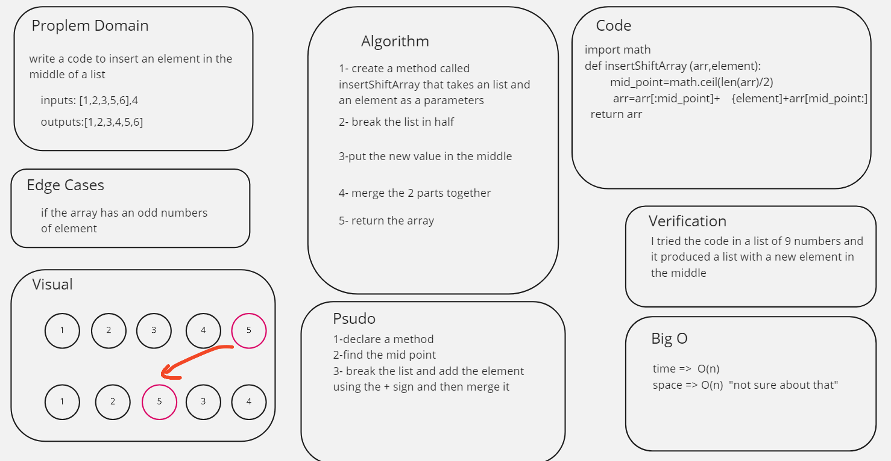

# Insert to Middle of an Array
<!-- Description of the challenge -->
it want us to write a code to insert an element in the middle of a list

## Whiteboard Process
<!-- Embedded whiteboard image -->

## Approach & Efficiency
<!-- What approach did you take? Discuss Why. What is the Big O space/time for this approach? -->
slice the array in half and merge it again after putting a new value in the middle

time =>  O(1)
space => O(1)  "not sure about this"
