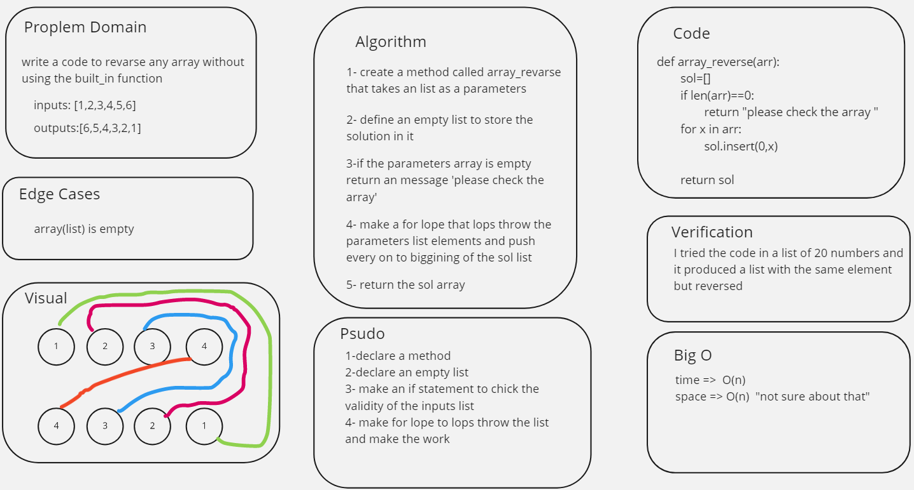

# Reverse an Array
<!-- Description of the challenge -->
it want us to write a code to revarse any array without using the built_in function

## Whiteboard Process
<!-- Embedded whiteboard image -->

## Approach & Efficiency
<!-- What approach did you take? Discuss Why. What is the Big O space/time for this approach? -->
just work with every element in the array alone and insert it in the biggining of a new array

time =>  O(n)
space => O(n)  "not sure about thit"
