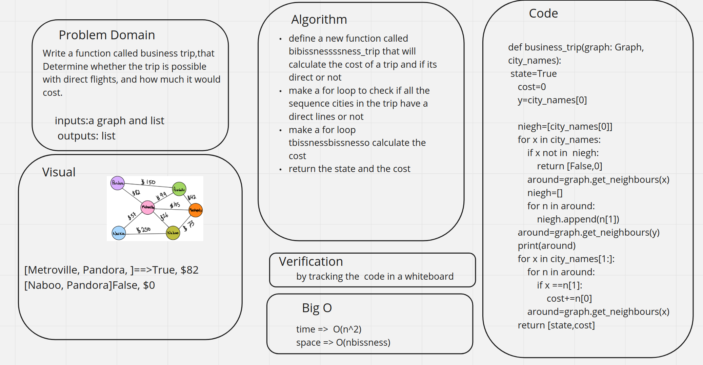

# Challenge Summary
<!-- Description of the challenge -->
Write a function called business trip,that Determine whether the trip is possible with direct flights, and how much it would cost.

## Whiteboard Process
<!-- Embedded whiteboard image -->

## Approach & Efficiency
<!-- What approach did you take? Why? What is the Big O space/time for this approach? -->
define a new function called bibissnessssness_trip that will calculate the cost of a trip and if its direct or not
make a for loop to check if all the sequence cities in the trip have a direct lines or not
make a for loop tbissnessbissnesso calculate the cost
return the state and the cost

time =>  O(n^2)
space => O(nbissness)
## Solution
<!-- Show how to run your code, and examples of it in action -->
the code is [here](bf.py)

the test is [here](test_bf.py)
