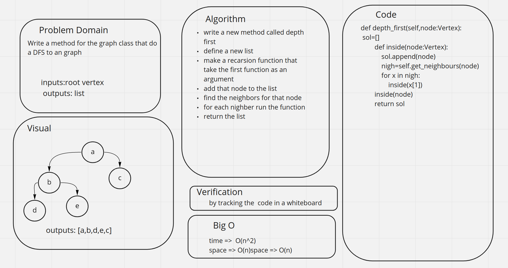

# Challenge Summary
<!-- Description of the challenge -->
Write a method for the graph class that do a DFS to an graph

## Whiteboard Process
<!-- Embedded whiteboard image -->

## Approach & Efficiency
<!-- What approach did you take? Why? What is the Big O space/time for this approach? -->
write a new method called depth first
define a new list
make a recarsion function that take the first function as an argument
add that node to the list
find the neighbors for that node
for each nighber run the function
return the list
## Solution
<!-- Show how to run your code, and examples of it in action -->
the code is here [code](graph.py)

the test is here [test](test_dfs.py)