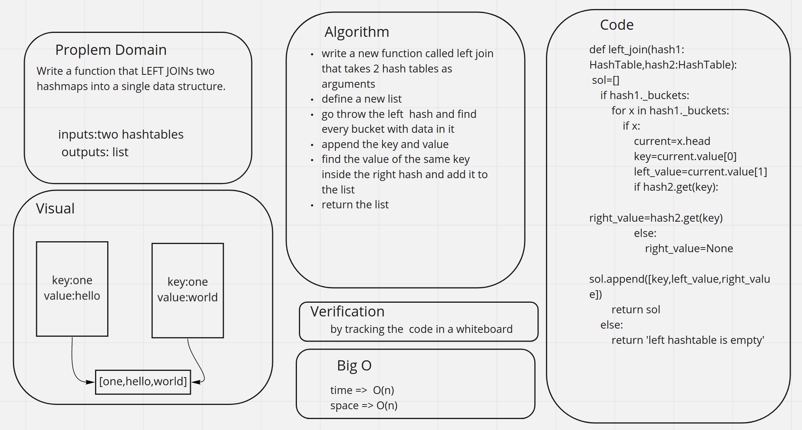

# Hashmap LEFT JOIN
<!-- Short summary or background information -->
The SQL LEFT JOIN returns all rows from the left table, even if there are no matches in the right table.
## Challenge
<!-- Description of the challenge -->
Write a function that LEFT JOINs two hashmaps into a single data structure.
## Approach & Efficiency
<!-- What approach did you take? Why? What is the Big O space/time for this approach? -->
write a new function called left join that takes 2 hash tables as arguments
define a new list
go throw the left  hash and find every bucket with data in it
append the key and value
find the value of the same key inside the right hash and add it to the list
return the list

the code is here [code](left_joint.py)

the tests are here [test](test_left.py)

## Solution
<!-- Embedded whiteboard image -->

