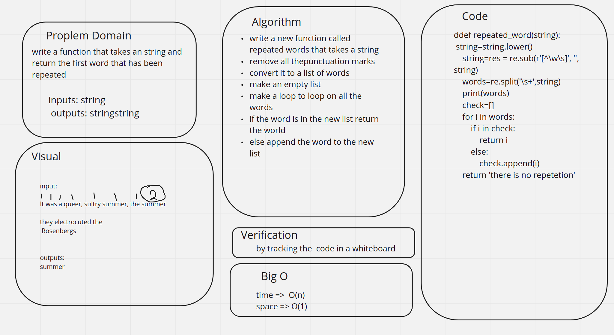

# Challenge Summary
<!-- Description of the challenge -->
Write a function called repeated word that finds the first word to occur more than once in a string

## Whiteboard Process
<!-- Embedded whiteboard image -->

## Approach & Efficiency
<!-- What approach did you take? Why? What is the Big O space/time for this approach? -->
write a new function called repeated words that takes a string

remove all thepunctuation marks

convert it to a list of words

make an empty list

make a loop to loop on all the words

if the word is in the new list return the world
else append the word to the new list
## Solution
<!-- Show how to run your code, and examples of it in action -->
the code is shown here [code](repeted.py)

the test is shown here [test](test_repeted.py)