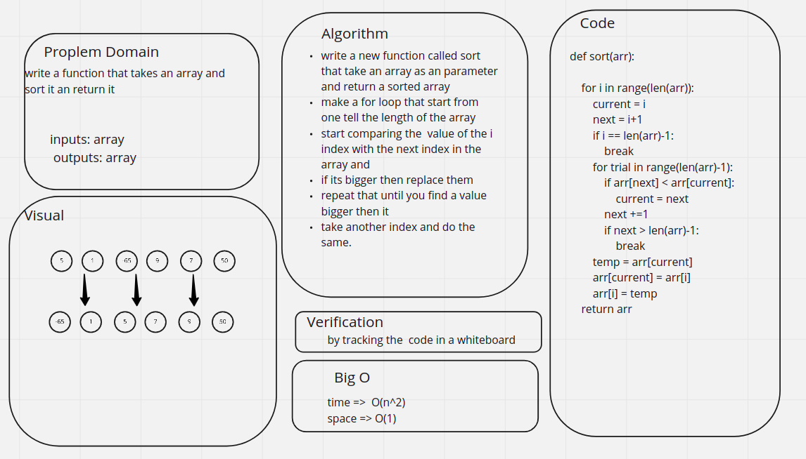

# Challenge Summary
<!-- Description of the challenge -->
Review the pseudocode below, then trace the algorithm by stepping through the process with the provided sample array. Document your explanation by creating a blog article that shows the step-by-step output after each iteration through some sort of visual.
## Whiteboard Process
<!-- Embedded whiteboard image -->

## Approach & Efficiency
<!-- What approach did you take? Why? What is the Big O space/time for this approach? -->
write a new function called sort that take an array as an parameter and return a sorted array

make a for loop that start from one tell the length of the array

start comparing the  value of the i index with the next index in the array and
if its bigger then replace them

repeat that until you find a value bigger then it

take another index and do the same.
## Solution
<!-- Show how to run your code, and examples of it in action -->
the code is shown her [code](./insertion.py)

the test is shown her [test](./test_sort.py)
