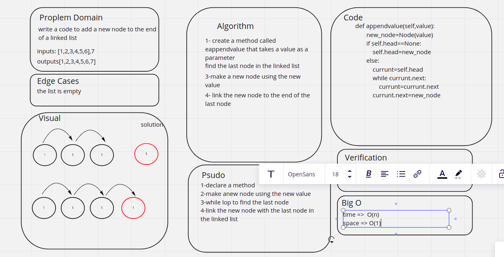
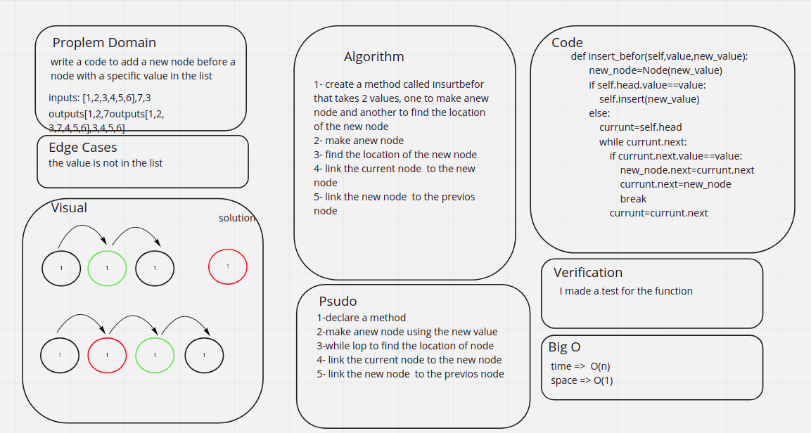
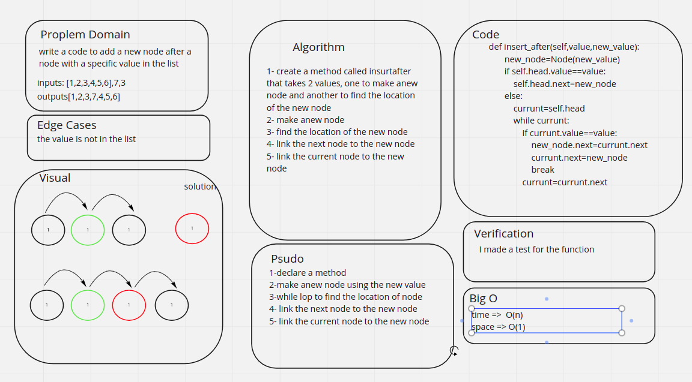

# Challenge Summary

make a functions to append or to insert in a linked list

## Whiteboard Process
<!-- Embedded whiteboard image -->

## Approach & Efficiency

by finding the right node whrere the change will happend around, cut the list in half and put the new node between and make a new link.

## Solution

the code was written on the same file with the linked lists code challenge in the [linked_list.py](../linked_list/linked_list/linked_lists.py)

the code was written on the same file with the linked lists code challenge in the [test_linked_list.py](../linked_list/tests/test_linked_list.py)