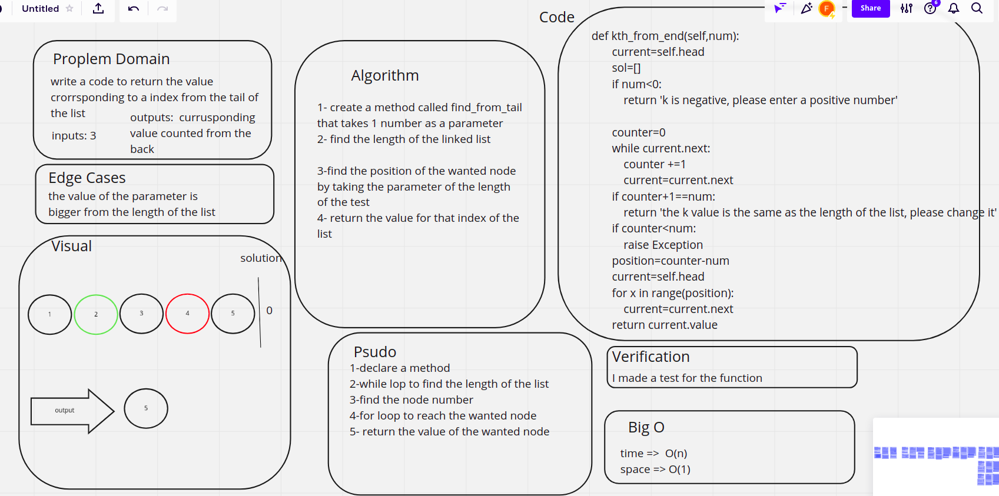

# Challenge Summary
<!-- Description of the challenge -->
write a code to return the value crorrsponding to a index from the tail of the list

## Whiteboard Process
<!-- Embedded whiteboard image -->

## Approach & Efficiency
<!-- What approach did you take? Why? What is the Big O space/time for this approach? -->

1- create a method called find_from_tail that takes 1 number as a parameter

2- save all the values in a list

3-reverse that list

4- return the value for that index of the list

## Solution
<!-- Show how to run your code, and examples of it in action -->

the code was written on the same file with the linked lists code challenge in the [linked_list.py](../linked_list/linked_list/linked_lists.py)

the code was written on the same file with the linked lists code challenge in the [test_linked_list.py](../linked_list/tests/test_linked_list.py)
