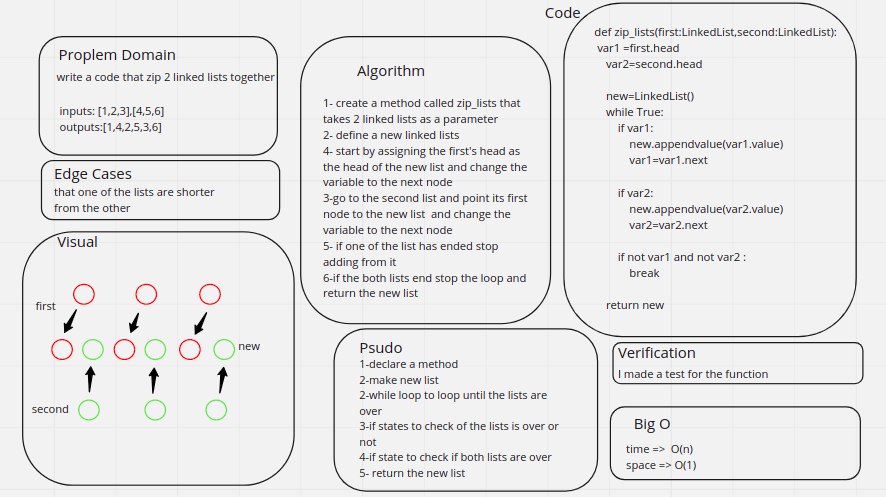

# Challenge Summary
<!-- Description of the challenge -->
write a code to zip to lists in one new list 

## Whiteboard Process
<!-- Embedded whiteboard image -->

## Approach & Efficiency
<!-- What approach did you take? Why? What is the Big O space/time for this approach? -->
1- create a method called zip_lists that takes 2 linked lists as a parameter

2- define a new linked lists

3- start by assigning the first's head as the head of the new list and change the variable to the next node

4-go to the second list and point its first node to the new list  and change the variable to the next node

5- if one of the list has ended stop adding from it

6-if the both lists end stop the loop and return the new list
## Solution
<!-- Show how to run your code, and examples of it in action -->

the code was written on the same file with the linked lists code challenge in the [linked_list_zip..py](./linked_list_zip.py)

the code was written on the same file with the linked lists code challenge in the [test_zip.py](./test_zip.py)
    