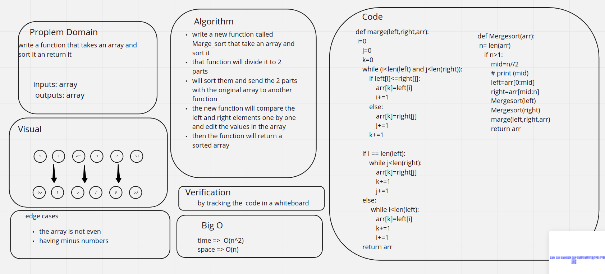

# Challenge Summary
<!-- Description of the challenge -->
 then trace the algorithm by stepping through the process with the provided sample array. Document your explanation by creating a blog article that shows the step-by-step output after each iteration through some sort of visual.
## Whiteboard Process
<!-- Embedded whiteboard image -->

## Approach & Efficiency
<!-- What approach did you take? Why? What is the Big O space/time for this approach? -->
write a new function called Marge_sort that take an array and sort it

that function will divide it to 2 parts

will sort them and send the 2 parts with the original array to another function

the new function will compare the left and right elements one by one and edit the values in the array

then the function will return a sorted array
## Solution
<!-- Show how to run your code, and examples of it in action -->
the code is shown her [code](./marge.py)

the test is shown her [test](./test_marge.py)

## for the BLOG file :

[BLOGE](./BLOG.md)