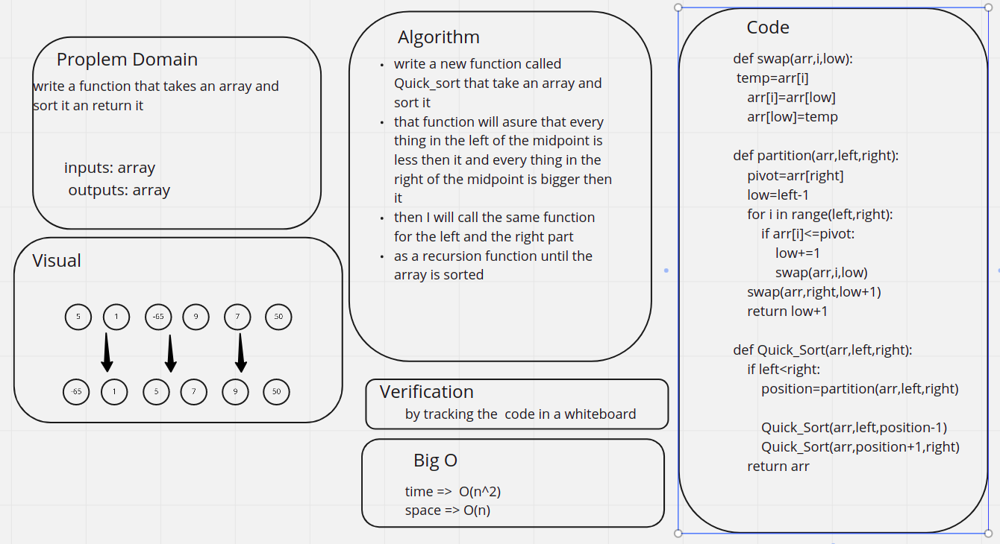

# Challenge Summary
<!-- Description of the challenge -->
trace the algorithm by stepping through the process with the provided sample array. Document your explanation by creating a blog article that shows the step-by-step output after each iteration through some sort of visual.

Once you are done with your article, code a working, tested implementation of Quick Sort based on the pseudocode provided.
## Whiteboard Process
<!-- Embedded whiteboard image -->

## Approach & Efficiency
<!-- What approach did you take? Why? What is the Big O space/time for this approach? -->
write a new function called Quick_sort that take an array and sort it

that function will asure that every thing in the left of the midpoint is less then it and every thing in the right of the midpoint is bigger then it

then I will call the same function for the left and the right part

as a recursion function until the array is sorted
## Solution
<!-- Show how to run your code, and examples of it in action -->
the code is shown her [code](./quick.py)

the test is shown her [test](./test_quick.py)

## for the BLOG file :

[BLOGE](./BLOG.md)