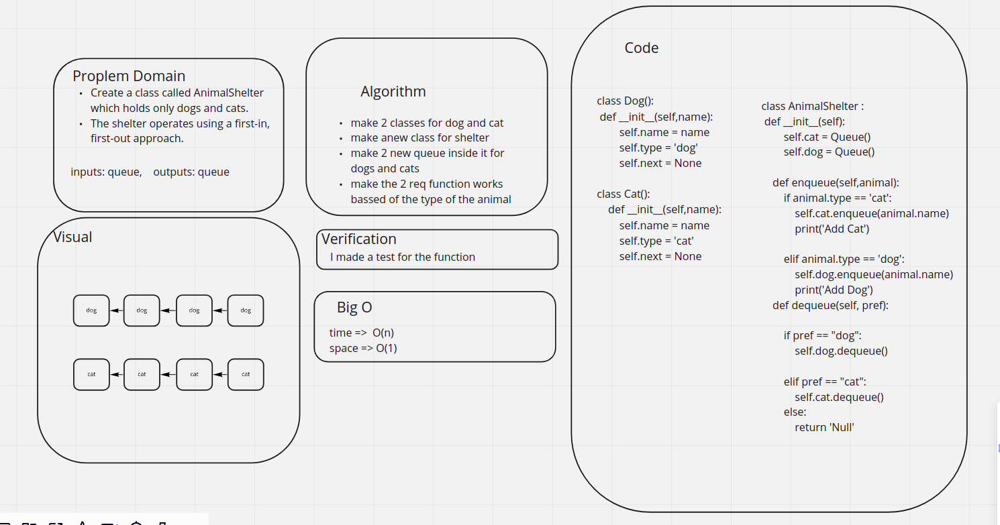

# Challenge Summary
<!-- Description of the challenge -->
Create a class called AnimalShelter which holds only dogs and cats.
The shelter operates using a first-in, first-out approach.
## Whiteboard Process
<!-- Embedded whiteboard image -->

## Approach & Efficiency
<!-- What approach did you take? Why? What is the Big O space/time for this approach? -->
make 2 classes for dog and cat
make anew class for shelter
make 2 new queue inside it for dogs and cats
make the 2 req function works bassed of the type of the animal
## Solution
<!-- Show how to run your code, and examples of it in action -->
the solution is shown in the [code](./stack_queue_animal_shelter.py)