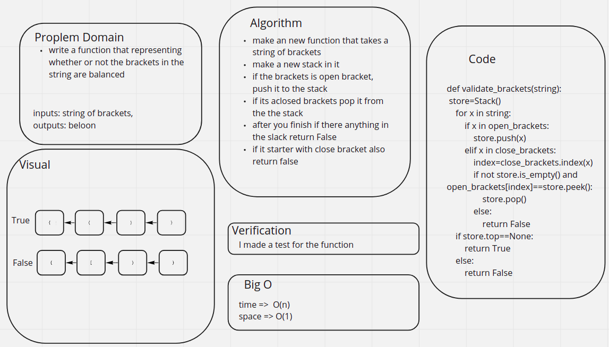

# Challenge Summary
<!-- Description of the challenge -->
write a function that representing whether or not the brackets in the string are balanced
## Whiteboard Process
<!-- Embedded whiteboard image -->

## Approach & Efficiency
<!-- What approach did you take? Why? What is the Big O space/time for this approach? -->
make an new function that takes a string of brackets
make a new stack in it

if the brackets is open bracket, push it to the stack

if its aclosed brackets pop it from the the stack

after you finish if there anything in the slack return False

if it starter with close bracket also return false
## Solution
<!-- Show how to run your code, and examples of it in action -->
the solution is shown in the [code](./stack_queue_brackets.py)

the test is shown in the [tests](./test_validate_brackets.py)