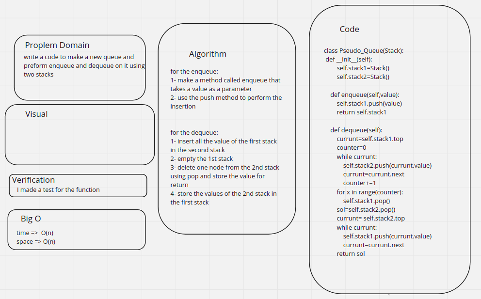

# Challenge Summary
<!-- Description of the challenge -->
write a code to make a new queue and preform enqueue and dequeue on it using two stacks

## Whiteboard Process
<!-- Embedded whiteboard image -->

## Approach & Efficiency
<!-- What approach did you take? Why? What is the Big O space/time for this approach? -->
for the enqueue:
1- make a method called enqueue that takes a value as a parameter
2- use the push method to perform the insertion

for the dequeue:
1- insert all the value of the first stack in the second stack
2- empty the 1st stack
3- delete one node from the 2nd stack
using pop and store the value for return
4- store the values of the 2nd stack in the first stack

time =>  O(n)
space => O(n)

## Solution
<!-- Show how to run your code, and examples of it in action -->
the code is [here](./code/stack_queue_pseudo.py)