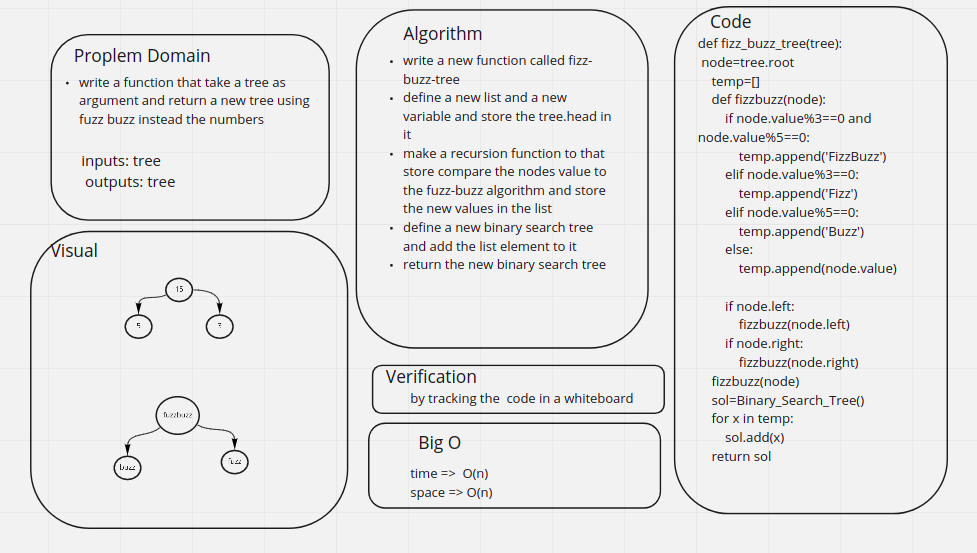

# Challenge Summary
<!-- Description of the challenge -->
write a function that take a tree as argument and return a new tree using fuzz buzz instead the numbers

## Whiteboard Process
<!-- Embedded whiteboard image -->

## Approach & Efficiency
<!-- What approach did you take? Why? What is the Big O space/time for this approach? -->
write a new function called fizz-buzz-tree

define a new list and a new variable and store the tree.head in it

make a recursion function to that store compare the nodes value to the fuzz-buzz algorithm and store the new values in the list

define a new binary search tree and add the list element to it

return the new binary search tree
## Solution
<!-- Show how to run your code, and examples of it in action -->
the code is shown  here [code](./tree_fizz_buzz/tree_fizz_buzz.py)

the test is showen here [test](./tree_fizz_buzz/test_fizzbuzz.py)
