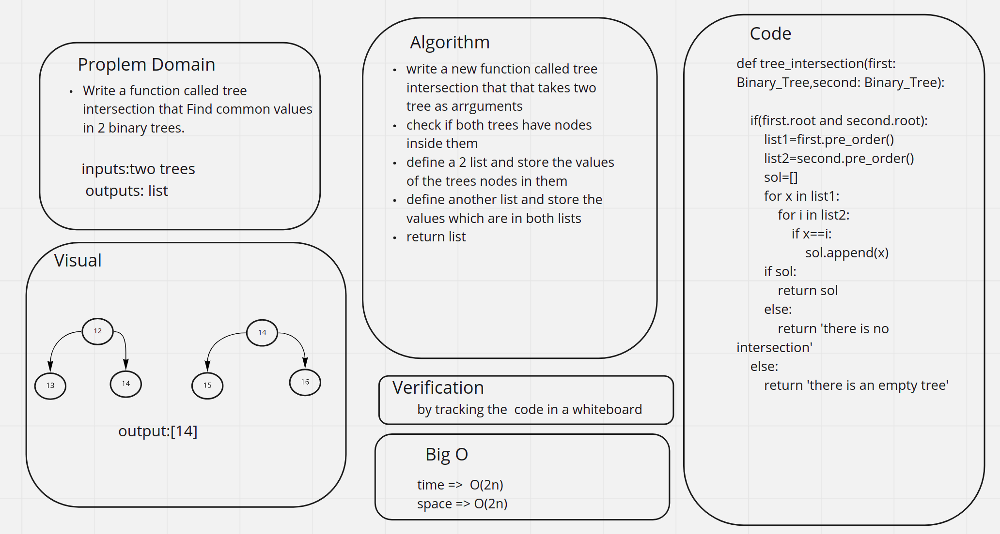

# Challenge Summary
<!-- Description of the challenge -->
Write a function called tree intersection that Find common values in 2 binary trees.

## Whiteboard Process
<!-- Embedded whiteboard image -->

## Approach & Efficiency
<!-- What approach did you take? Why? What is the Big O space/time for this approach? -->
write a new function called tree intersection that that takes two tree as arrguments

check if both trees have nodes inside them

define a 2 list and store the values of the trees nodes in them

define another list and store the values which are in both lists

return list

## Solution
<!-- Show how to run your code, and examples of it in action -->
the code is shown here [code](intersection.py)

the test is shown here [test](test_intersection.py)
