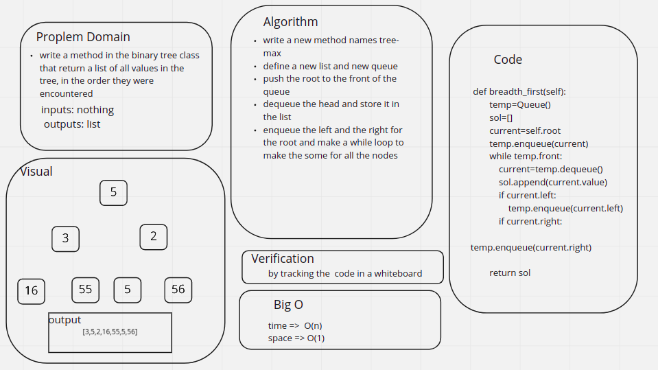

# Challenge Summary
<!-- Description of the challenge -->
write a method in the binary tree class that return a list of all values in the tree, in the order they were encountered## Whiteboard Process
<!-- Embedded whiteboard image -->

## Approach & Efficiency
<!-- What approach did you take? Why? What is the Big O space/time for this approach? -->
write a new method names tree-max

define a new list and new queue

push the root to the front of the queue

dequeue the head and store it in the list

enqueue the left and the right for the root and make a while loop to make the some for all the nodes

## Solution
<!-- Show how to run your code, and examples of it in action -->

the solution is shown in here [code](./trees.py)

the test are shown here [test](./trees_test.py)