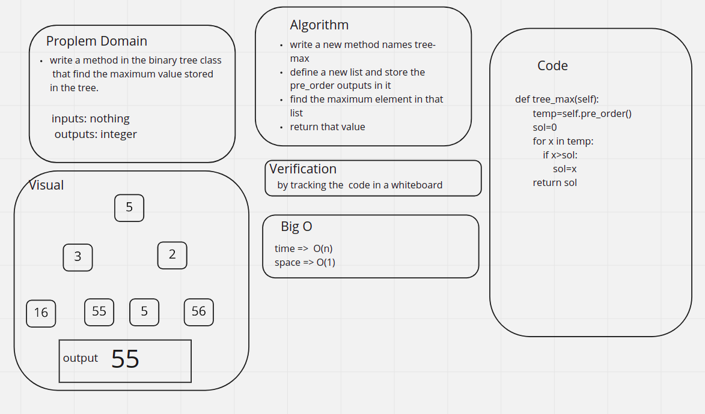

# Challenge Summary
<!-- Description of the challenge -->
write a method in the binary tree class  that find the maximum value stored in the tree.
## Whiteboard Process
<!-- Embedded whiteboard image -->

## Approach & Efficiency
<!-- What approach did you take? Why? What is the Big O space/time for this approach? -->
write a new method names tree-max

define a new list and store the pre_order outputs in it

find the maximum element in that list

return that value

## Solution
<!-- Show how to run your code, and examples of it in action -->

the solution is shown in here [code](./trees.py)

the test are shown here [test](./trees_test.py)